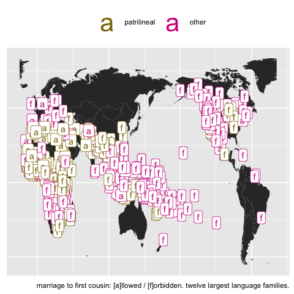
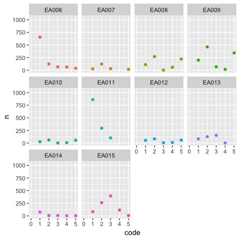
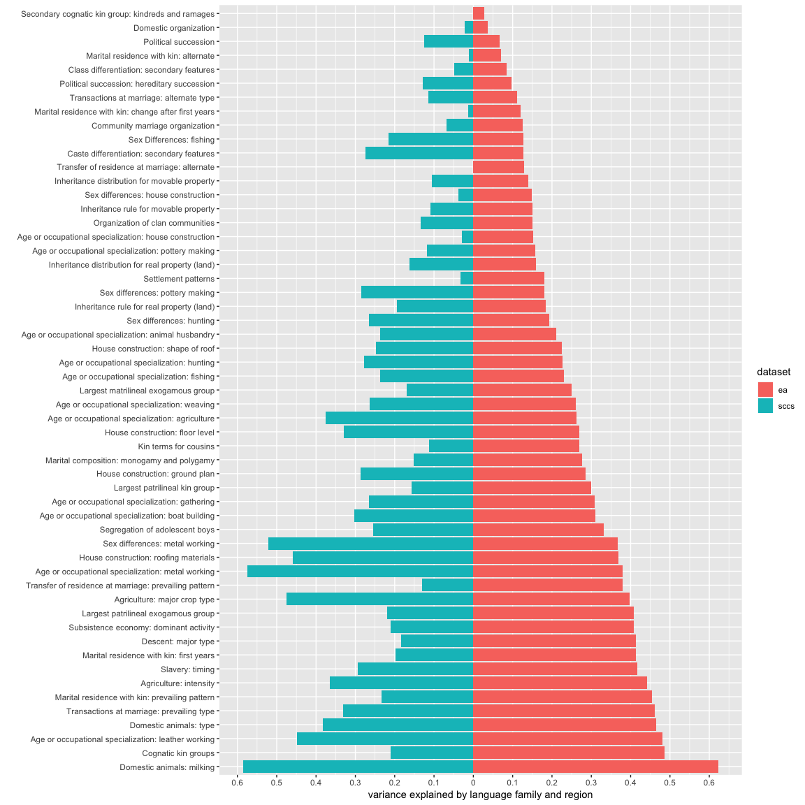

Is the Standard Cross-Cultural Sample really standard?
======================================================

Galton's problem
----------------

Similarity between cultures can be due to shared ancestry, borrowing, and the co-evolution of traits. It is difficult to infer on the latter without taking ancestry and borrowing into account. (Here is an elegant [summary](www.jstor.org/stable/pdf/3449291.pdf).)

If we observe a correlation between two traits in a cross-cultural database, is this due to autocorrelation in the data or a meaningful process that results in co-evolution? People tend to get around this in two ways:

1.  We can control for Galton's problem in various ways (such as grouping societies across languages and regions)
2.  We can use a representative sample to test our hypotheses.

Cousin marriage and descent in the Ethnographic Atlas
-----------------------------------------------------

Here is a specific example: In Veiled Sentiments (1986), Lila Abu-Lughod looks at a patrilineal Bedouin group. She argues that marrying your male first cousin is beneficial for women in this group, because it keeps them in the patriline -- they stay with their own family after marriage.

Is this a cross-cultural phenomenon? We could test this using the Ethnographic Atlas (EA, via the D-Place database), which has data on main line of descent and prevalence of cousin marrige.

The EA contains 1290 societies across 138 language families and 50 geographic-cultural regions. Cultural behaviour is coded across 94 different variables.

Let's do something simple and ask this question: if a society has patrilineal descent, does it allow marriage to first cousins? If there is a correlation, it indicates that Abu-Lughod observed a universal(ish) pattern.

The EA codes descent and cousin marriage as two separate variables (EA043 and EA023). We have 1036 / 1291 societies with data for both.

We can make a simple cross-tabulation:

|                     |  first cousin marriage absent|  first cousin marriage present|
|---------------------|-----------------------------:|------------------------------:|
| other descent       |                           543|                             46|
| patrilineal descent |                           377|                             70|

There are more instances of allowing first cousin marriage in patrilineal societies. Or so it looks.

If we map the data, we see what we already saw in the table: more gold (patrilineal) societies \[a\]llow marriage to first cousins than non-patrilineal ones, even within the 12 largest language families, shown in the figure. Note though that same colours and a/p values seem to cluster together, indicating regional/language family effects.

We fit a binomial regression model estimating whether first cousin marriage is allowed, using whether a society is patrilineal as a predictor. This is pretty simplistic, but works as an illustration. (Note that I'm fitting the regression using a Generalised Additive Model framework (Wood 2016).)

Fit 1 estimates that the effect of having patrilineal descent is strong on permission on first cousin marriage (b = 0.78, se = 0.2) Maybe this pattern is universal! What happens if we control for **language family** and **region**?

The effect disappears in Fit 2 (b = 0.02, se = 0.3). If we compare the models using the Akaike Information Criterion and a Chi-square test of the REML scores, we see that Fit 2 provides a much better fit (p &lt; 0.001).

I was a bit dishonest earlier; a GAM helpfully calculates the pseudo-r squared (r²) for us, which provides an estimate of how much variance is explained by the model. The r² of Fit 1 is, in fact, very low (0.01). This means that this model explains very little variance in the sample, significant effect or not. In contrast, the r² of Fit 2 is 0.37, which is much higher.

Another way of controlling for Galton's problem is to take a sample of human societies that is representative in some way -- that is sampled consistently across language families and cultural-geographical regions. The Standard Cross-Cultural Sample is an example of that.

The SCCS has a different set of variables. But the societies in the SCCS are a proper subset of the societies in the EA. So we can still rely on the EA variables, but only look at societies that are in the SCCS. If the SCCS is a representative sample, this should extend to the EA variables as well.

Fit 3 is the same as fit 1, except the sample is different. The effect of patrilineal descent on cousin marriage is absent here (b = 0.48, se = 0.44).

What we see in Fit 3 is that, when testing on societies in the SCCS only, the effect is absent. Note that we didn't include random intercepts -- they may or may not improve on the model. The point is, the SCCS sample does not allow us to reject the null, indicating what we suspected all along: the EA is not a weighted sample.

This does not preclude that there is a real cross-cultural correlation here. The coding I used is very simplistic and collapses a lot of information. The point is that the SCCS sample acts like the EA sample with random intercepts grouping societies under language family and cultural-geographic region.

Variation explained by language family and region in the EA
-----------------------------------------------------------

Can we consistently assess the size of variance explained by family and region in the EA? Can we compare it to the SCCS?

Most (almost all) variables in the EA are categorical: their levels cannot be ordered in a straightforward way ("patrilineal" is not more or less than "matrilineal" and so on).

What we could do is fit a multinomial model to estimate the distribution of the levels for each predictor, using Generalised Additive Modelling (Wood 2016). However, this takes a very-very long time and might not actually work, because there are too many levels and too little data. Remember, we have to find a solution that will work for the SCCS as well (195 societies versus 1290 in the EA)

Instead, we cheat, and fit a binomial model on the most frequent level of each variable.

For example, "patrilineal" is the most frequent level of the "descent" variable, with 589/1036 societies with data being patrilineal.

We can estimate an intercept for "society is patrilineal" with a language family and a region random intercept (fit 4).

The r² of Fit 4 is 0.43, indicating that language family and region explain a large amount variation in whether a society is patrilineal or not.

We can fit the same model on societies in the SCCS (fit 5). The r² of Fit 5, fit on the SCCS, is 0.26. It's lower -- family and region matter less in the SCCS. But they still matter, to a degree.

This won't work this nicely for a lot of variables. Even where it does, it collapses a lot of information, as it treats all other levels of the variable as one thing. But we don't exactly aim at modelling accuracy here. The end game is to compare the EA to the SCCS, and we want methods that scale.

### Setting up

In order for this to work for all variables (or most of them, at least), we need to make a few adjustments. First, this will only really work for categorical predictors. Lucky us, most variables in the EA are categorical:

| type        |  number\_of\_variables|
|:------------|----------------------:|
| Categorical |                     84|
| Continuous  |                      1|
| Ordinal     |                      9|

The problem is that a lot of these categories have a lot of levels and the ratio of observations across levels is not necessarily skewed: in many cases, each level has about the same amount of observations for it. This makes picking a "most populous level" especially awkward.

I show this for the first ten variables below. EAxxx is the variable name, and code is the numeric coding of the variable levels:

This is actually even more complicated, as not all variables are coded from 1 to n. But the point comes across.

Another issue is non-informative levels. Missing data are coded as such in the EA, but a number of levels also clearly refer to lack of a pattern (if not lack of information), and trying to predict the absence of something is probably not very informative. The suspect levels for categorical variables are:

-   "^Absent/absence" (etc)
-   "Activity is absent"
-   "Activity present, sex diff. unspecified"
-   "None"
-   "None preferred"

We should remove these.

Given the remaining data, for each variable, we pick the levels with the most observations.

I fretted earlier that a number of variables have the data distributed relatively evenly across levels. This is bad. We can guess that a binomial regression model that is trying to predict 19/1290 observations isn't going to do too well. Not to mention that, in the SCCS, there are only 195 societies.

So, we impose an arbitrary cutoff, and only include variables which have at least 300 observations for the largest level.

We are left with 55 / 84 variables. This captures 70,100 observations in the EA (/120,000), but you can't make an omelette without breaking some eggs.

### Running the model

We fit a binomial model on each variable, estimating nothing but an intercept and random intercepts for language family and region. The outcome is whether the variable level is the biggest level (e.g. "is descent patrilineal?"). We end up with a vector of r²-s, one for each model, and, by proxy, for each of the remaining variables.

Variation explained by language family and region in the SCCS
-------------------------------------------------------------

The r²-s for the EA are not going to be super interesting in themselves. We know that a lot of cultural traits co-vary with language and location. What is more interesting is how the EA, an unweighted sample, compares with the SCCS, a smaller, but, in return, weighted sample of humans. We can essentially repeat the method of assessing co-variation on the societies in the SCCS.

We do run the risk that the most populous level of a variable in the EA will not be the most populous in the SCCS subset, but doing the count again would make the results pretty hard to compare. In the end, we can probably assume that the major subcategory under each category is conceptually robust enough to scale down to the subset.

After all this, we have r² values which express, for each of the 55 surviving categorical variables, the amount of variance explained by a simple language family and region random intercept. We have pairs of values: one value from a model fit on all societies in the EA, and one from the same model fit on the SCCS.

Caveats abound.

1.  We work with samples of both of these datasets, albeit very large ones.
2.  The way we coded the variables makes a lot of information invisible for the models.
3.  Really smart people would use more phylogenetic information than two simple grouping factors to assess the effects of cultural relatedness. (Obviously, German has more to do with Dutch than with Farsi, but this information is absent from our models, which group German, Dutch, and Farsi (etc) on the one hand and e.g. Kazakh and Turkmen (etc) on the other.)
4.  r² might not be the best way to compare models, but it is less obviously sensitive to sample size, which is a major difference between these sets.
5.  We should probably also compare each model to a model with *no random effects* to see whether it provides a significantly better fit, but this is abstract enough as it is.

Bearing that in mind, here is a plot of r²-s from the two types of models across the 55 categorical variables.

Family and region explain **less** variance in the SCCS than in the EA, as expected. But their effect is not negligible. **This encourages discretion in the use of the SCCS, because human culture is more complicated than it seems.**
