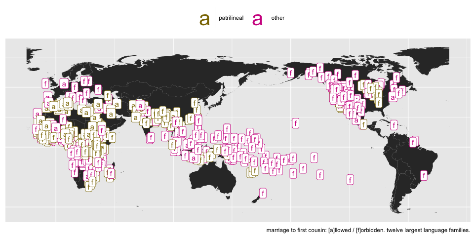
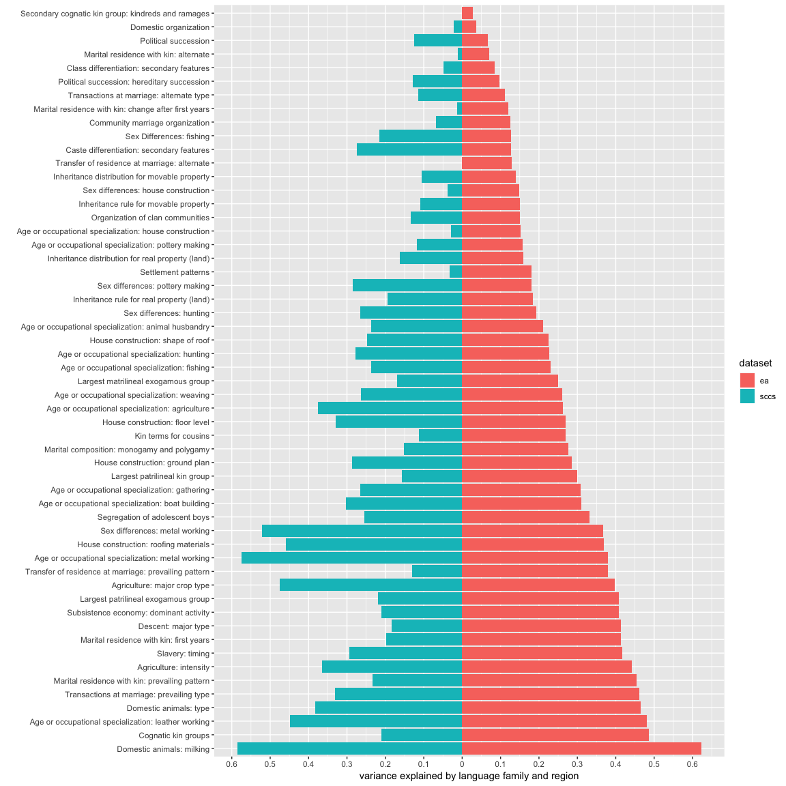

Balanced and unbalanced ethnographic samples: under the bonnet
==============================================================

> This is the under-the-bonnet file for the blog post ["Is the Standard Cross-Cultural Sample Really Standard?"](https://excd.org/2018/03/01/stats-corner-is-the-standard-cross-cultural-sample-really-standard/). It walks the reader through the data wrangling, keeping theory to a minimum.

Galton's problem
----------------

Sir Francis Galton noticed that certain claims about the correlations of cultural traits were amplified because the people who made them ignored the fact that the data sources -- the societies where these correlations were recorded -- tended to be similar more generally. (Here is an elegant [summary](www.jstor.org/stable/pdf/3449291.pdf).)

This is the problem of *statistical autocorrelation*. It has come up during the 2016 US Presidential Election, when some pollsters didn't sufficiently adjust for the fact that polling errors in neighbouring states will be correlated, and so apparent trends (like Clinton leading in polls) will be amplified.

There are two ways to get round this:

1.  Use statistical methods to control for autocorrelation in your data.
2.  Use a balanced **sample** that is representative of your population.

Number 2 sounds easier, and cultural anthropologists have gone down this route quite often. The point I will make here is that a balanced sample might not be as balanced as it seems. To make this point, I will use two cross-cultural **databases**: (i) the Ethnographic Atlas (EA, which is not balanced), and (ii) the Standard Cross-Cultural Sample (SCCS, which was built with balance in mind). I will use a simple example drawn from a famous ethnography of Bedouin Arabs.

Cousin marriage and descent in the Ethnographic Atlas
-----------------------------------------------------

``` r
library(stringr)  # for strings
library(tidyverse)  # for data wrangling
library(knitr)  # for knitting
library(itsadug)  # for gams
library(ggmap)  # for maps

ea = read.csv("Data/ea_tidy.csv")  # this is our data file. I curled it from the github repo of the D-Place database, which provides an interface to the EA (and other cross-cultural databases). see the helper file for details.

mapWorld <- map_data("world", wrap = c(-25, 335), ylim = c(-55, 75))  # this is the world; pacific centered

ea$lon2 <- ifelse(ea$lon < -20, ea$lon + 360, ea$lon)  # need to fix longitudes for the pacific centering!
```

In Veiled Sentiments (1986), Lila Abu-Lughod looks at a patrilineal Bedouin group. She argues that marrying your male first cousin is beneficial for women in this group, because it keeps them in the patriline -- they stay with their **father's family** (and by proxy, their own family) after marriage.

Is this a cross-cultural phenomenon? Does this **explanation** work cross-culturally?

The Ethnographic Atlas has data on main line of descent and prevalence of cousin marrige.

The EA contains 1290 societies across 138 language families and 50 geographic-cultural regions. Cultural behaviour is coded across 94 different variables.

Here's a question: if a society has patrilineal descent, does it allow marriage to first cousins? If there is a correlation, it indicates that Abu-Lughod observed a universal(ish) pattern.

``` r
cousin = ea %>% # we gonna call this subdataframe "cousin"
  filter(title == 'Cousin marriages permitted', !is.na(code)) %>%  # look up cousin marriage
    mutate(marry_first_cousin = ifelse(name == 'Any first cousins', T, F)) %>% # mark societies that allow first cousin marriage
      select(society,family,region,marry_first_cousin,in_sccs,lon2,lat) # we keep what we need

cousin = ea %>% 
  filter(title == 'Descent: major type', !is.na(code)) %>%  # now look up descent
    mutate(patrilineal = ifelse(name == 'Patrilineal', T, F)) %>%  # mark societies with patrilineal descent
      select(society,family,region,patrilineal) %>% 
        merge(cousin) # merge the two sets
```

The EA codes descent and cousin marriage as two separate variables (EA043 and EA023). We have 1036 / 1291 societies with data for both.

We can make a simple **cross-tabulation**:

``` r
ctable = cousin %>% 
  group_by(patrilineal,marry_first_cousin) %>% # group data by the two vars
    summarise(n = n()) %>% # count number of societies / data
      reshape2::dcast(patrilineal ~ marry_first_cousin) # morph it into a table

ctable$patrilineal = recode(as.factor(ctable$patrilineal), 'TRUE' = 'patrilineal descent', 'FALSE' = 'other descent') # make the table human-readable 1
names(ctable) = c('','first cousin marriage absent','first cousin marriage present') # make the table human-readable 2
kable(ctable) # make the table markdown friendly
```

|                     |  first cousin marriage absent|  first cousin marriage present|
|---------------------|-----------------------------:|------------------------------:|
| other descent       |                           543|                             46|
| patrilineal descent |                           377|                             70|

There are more instances of allowing first cousin marriage in patrilineal societies. So this is a universal pattern, and Lila Abu-Lughod's explanation might hold sway in many human cultures, not only amongst Bedouin Arabs. (She doesn't jump to this conclusion, herself!)

Or so it looks.

If we map the data, we see what we already saw in the table: more gold (patrilineal) societies \[a\]llow marriage to first cousins (as opposed to \[f\]orbid it) than non-patrilineal ones, even within the 12 largest language families, shown in the figure.

Note though that same colours and a/f values seem to cluster together, indicating regional/language family effects: as it happens, groups speaking related languages / living closer together tend to be either patrilineal (or not), and to have marriage to first cousins (or not).

This is suspect -- maybe all we see is autocorrelation between group traits, not a "real"" universal.

``` r
biggest_family <- cousin %>% # we don't want to plot all data, it would be incomprehensible.
  filter(family!='') %>%  
  group_by(family) %>% # we count number of languages per language family
  summarise(n = n()) %>% 
  arrange(-n) %>% # sort fams from largest to smallest
  head(12) %>% # and keep the first twelve
  pull(family) # put the names into a vector

cousin_big <- cousin %>% # use the vector to filter data
  filter(family %in% biggest_family)

ggplot() + # let's plot...
  geom_polygon(data = mapWorld, aes(x=long, y = lat, group = group)) + # the world (pacific centred, as you should)
  geom_label(data = cousin_big, aes(x = lon2, y = lat, colour = patrilineal, label = ifelse(marry_first_cousin, 'a','f'))) + # societies in the 12 largest lang fams: colour depends on line of descent (patrilineal or not). label depends on whether marriage to first cousins is [a]llowed/[f]orbidden
  theme(axis.title.x=element_blank(), axis.text.x=element_blank(), axis.ticks=element_blank(), axis.title.y=element_blank(), axis.text.y=element_blank()) + # we don't need x/y ticks, people know where Africa is
  scale_fill_continuous(guide = guide_legend()) + #special legend
  theme(legend.position="top") +  # on top
  guides(colour = guide_legend(override.aes = list(size=11))) +
  scale_colour_manual(name = '', breaks = c('TRUE', 'FALSE'), labels = c('patrilineal', 'other'), values = c('violetred','gold4')) + # with custom labels
  labs(caption = 'marriage to first cousin: [a]llowed / [f]orbidden. twelve largest language families.') # and a caption.
```



How do we quantify this potential correlation?

We fit a binomial generalised linear regression model estimating whether first cousin marriage is allowed, using whether a society is patrilineal as a predictor. This is pretty simplistic, but works as an illustration. (Note that I'm fitting the regression using a Generalised Additive Model framework (Wood 2016), because it's *fast*. This will come handy later.)

``` r
fit1 = gam(marry_first_cousin ~ patrilineal, data = cousin, family = binomial(link = logit), 
    method = "ML")

fit1b = round(summary(fit1)$p.table[2, 1], 2)  # estimate for cousin marriage effect
fit1se = round(summary(fit1)$p.table[2, 2], 2)  # error for cousin marriage effect
```

Fit 1 estimates that the effect of having patrilineal descent is strong on permission on first cousin marriage (b = 0.78, se = 0.2) Maybe this pattern **is** universal. What happens if we control for **language family** and **region**?

``` r
fit2 = gam(marry_first_cousin ~ patrilineal + s(family, bs = "re") + s(region, 
    bs = "re"), data = cousin, family = binomial(link = logit), method = "ML")  # same as fit1, except with family and region random intercepts / grouping factors

fit2b = round(summary(fit2)$p.table[2, 1], 2)
fit2se = round(summary(fit2)$p.table[2, 2], 2)
```

The effect **disappears** in Fit 2 (b = 0.02, se = 0.3).

If we compare the models using the Akaike Information Criterion and a Chi-square test of the REML scores, we see that Fit 2 provides a much better fit (p &lt; 0.001).

I was a bit dishonest earlier; a GAM helpfully calculates the pseudo-r squared (r²) for us, which provides an estimate of how much variance is explained by the model. The r² of Fit 1 is, in fact, very low (0.01). This means that this model explains very little variance in the sample, significant effect or not. In contrast, the r² of Fit 2 is 0.37, which is much higher.

Societies cluster together geographically (they live in the same regions) and in their ancestry (e.g. speaking related languages). Once you take this into account, our purported universal correlation between line of descent and marriage practices goes away.

This is much like US states polling similarly because they are similar culturally: a systematic polling error would show up the same way across many states, inflating the polling results.

(As a matter of fact, using large geographic regions and complete language families is a rather poor way of controlling for similarities between societies -- languages and cultures are correlated in more complex ways, and the evolutionary anthropology toolkit has some nifty tools to account for that. But the simple approach did the job here.)

Cousin marriage and descent in the Standard Cross-Cultural Sample
-----------------------------------------------------------------

Another way of controlling for Galton's problem is to take a sample of human societies that is representative in some way -- that is sampled consistently across language families and cultural-geographical regions. The Standard Cross-Cultural Sample (SCCS) is an example of that.

The SCCS has a different set of variables. But the societies in the SCCS are a proper subset of the societies in the EA. So we can still rely on our variables of line of descent + cousin marriage, but only look at societies that are in the SCCS.

Let's refit Fit 1 on the societies in this balanced sample.

``` r
fit3 = gam(marry_first_cousin ~ patrilineal, data = cousin[cousin$in_sccs == 
    T, ], family = binomial(link = logit))  # we only keep data that are in the sccs!

fit3b = round(summary(fit3)$p.table[2, 1], 2)  # get estimate
fit3se = round(summary(fit3)$p.table[2, 2], 2)  # get error
```

Fit 3 is the same as Fit 1, except the sample is different. The effect of patrilineal descent on cousin marriage is absent here (b = 0.48, se = 0.44).

What we see in Fit 3 is that, when testing on societies in the SCCS only, the effect is absent. Note that we didn't include random intercepts -- they may or may not improve on the model. The point is, the SCCS sample does not allow us to reject the null, indicating what we suspected all along: the EA is **not a weighted sample**.

This does not preclude that there is a real cross-cultural correlation here. The coding I used is very simplistic and collapses a lot of information. The point is that the SCCS sample acts more or less like the EA sample with random intercepts grouping societies under language family and cultural-geographic region: the apparent tend in Fit 1 is absent here.

Comparing the balanced and the unbalanced sample
================================================

Can we do what we did for many variables? Maybe for all variables?

Can we consistently assess the size of variance explained by family and region in the EA? Can we compare it to the SCCS?

Variation explained by language family and region in the SCCS
-------------------------------------------------------------

Most (almost all) variables in the EA are categorical: their levels cannot be ordered in a straightforward way ("patrilineal" is not more or less than "matrilineal" and so on).

What we could do is fit a multinomial model to estimate the distribution of the levels for each predictor, using Generalised Additive Modelling (Wood 2016). However, this takes a very-very long time and might not actually work, because there are too many levels and too little data. Remember, we have to find a solution that will work for the SCCS as well (195 societies versus 1290 in the EA).

Instead, we cheat, and fit a binomial model on the most frequent level of each variable.

For example, "patrilineal" is the most frequent level of the "descent" variable, with 589/1036 societies with data being patrilineal.

The gist of this is that we are simplifying coding in the data to a large degree in order to come up with an approach that applies consistently. It's a trade-off.

We can estimate an intercept for "society is patrilineal" with a language family and a region random intercept (Fit 4).

``` r
fit4 = gam(patrilineal ~ 1 + s(family, bs = "re") + s(region, bs = "re"), data = cousin, 
    family = binomial(link = logit), method = "ML")
```

The r² of Fit 4 is 0.43, indicating that language family and region explain a large amount variation in whether a society is patrilineal or not. (We see this in Fit 2, too.)

``` r
fit5 = gam(patrilineal ~ 1 + s(family, bs = "re") + s(region, bs = "re"), data = cousin[cousin$in_sccs == 
    T, ], family = binomial(link = logit), method = "ML")
```

We can fit the same model on societies in the SCCS (fit 5). The r² of Fit 5, fit on the SCCS, is 0.26. It's lower -- family and region matter less in the SCCS. But they still matter, to a degree.

This won't work as nicely for a lot of variables. Even where it does, it collapses a lot of information, as it treats all other levels of the variable as one thing. But we don't exactly aim at modelling accuracy here. The end game is to compare the EA to the SCCS, and we want methods that scale.

### Setting up

In order for this to work for all variables (or most of them, at least), we need to make a few adjustments. First, this will only really work for categorical predictors. Lucky us, most variables in the EA are categorical:

``` r
ea %>% 
  select(var_id,type) %>% # grab variables and their types
    unique %>% # one of each!
      group_by(type) %>%  # group them by type
        summarise(number_of_variables = n()) %>% # and count how many variables are in each type
          kable# number of variables per type
```

| type        |  number\_of\_variables|
|:------------|----------------------:|
| Categorical |                     84|
| Continuous  |                      1|
| Ordinal     |                      9|

The problem is that a lot of these categories have a lot of levels and the ratio of observations across levels is not necessarily skewed: in many cases, each level has about the same amount of observations for it. This makes picking a "most populous level" especially awkward.

I show this for the first ten variables below. EAxxx is the variable name, and code is the numeric coding of the variable levels:

``` r
vars = ea %>% # let's get the categorical variables' names
  filter(type == 'Categorical') %>% 
    select(var_id) %>%
      droplevels %>% 
        pull %>% 
          levels # vars vector: only grab categorical variables

ea %>% 
  filter(var_id %in% vars[1:10]) %>% # take first ten
    group_by(var_id,code) %>% # count number of societies / data per level
      summarise(n = n()) %>%
        ggplot(aes(x = code, y = n, colour = var_id)) + #plot them!
          geom_point() +
            xlim(0,5) +
              facet_wrap(~ var_id) +
                theme(legend.position = 'none')
```


This is actually even more complicated, as not all variables are coded from 1 to n. But the point comes across.

Another issue is non-informative levels. Missing data are coded as such in the EA, but a number of levels also clearly refer to lack of a pattern (if not lack of information), and trying to predict the absence of something is probably not very informative. The suspect levels for categorical variables are:

-   "^Absent/absence" (etc)
-   "Activity is absent"
-   "Activity present, sex diff. unspecified"
-   "None"
-   "None preferred"

We should remove these.

``` r
ea2 = ea %>% # we take the ea data
        filter(var_id %in% vars) %>% # and only keep categorical variables
          droplevels

drop_these ='(^[Aa]bsen.*$|Activity is absent|Activity present, sex diff. unspecified|None|None preferred)'

ea2$code = ifelse(str_detect(ea2$name, drop_these), NA, ea2$code) # if you have any of the strings in drop_these in your level coding, the level coding should go
```

Given the remaining data, for each variable, we pick the levels with the most observations.

``` r
level_matcher = ea2 %>%
                  filter(!is.na(code)) %>% # drop empty levels
                    group_by(var_id,code) %>% 
                      summarise(n = n()) %>% # count data per level
                        arrange(-n,var_id) %>% 
                          ungroup()# get data counts per var level

level_highest = level_matcher[!duplicated(level_matcher$var_id),] # get highest counts
```

I fretted earlier that a number of variables have the data distributed relatively evenly across levels. This is bad. We can guess that a binomial regression model that is trying to predict 19/1290 observations isn't going to do too well. Not to mention that, in the SCCS, there are only 195 societies.

So, we impose an arbitrary cutoff, and only include variables which have at least 300 observations for the largest level.

``` r
level_highest = level_highest %>% # we know what level has the most data (the "highest" level) for each variable. 
  filter(n > 299) # now we cull those levels that have fewer than 300 data to them

ea2 = ea2 %>% 
  filter(var_id %in% level_highest$var_id) # now we throw out the variables for which the highest levels don't meet the above criterion

vars = vars[vars %in% level_highest$var_id] # and take note of the new variable list.
```

We are left with 55 / 84 variables. This captures 70,100 observations in the EA (/120,000), but you can't make an omelette without breaking some eggs.

``` r
# Finally, we set up a dummy boolean for each variable's biggest level (like "patrilineal" above).
highest_matcher = level_highest %>%
                  mutate(var_id_code = paste(var_id,code, sep = '_')) %>% 
                    select(var_id_code) %>% 
                      pull
                     # we set up a dummy variable

ea2 = ea2 %>% # we set up the same dummy in the ea data and pair them up
       mutate(var_id_code = paste(var_id,code, sep = '_')) %>% 
         mutate(biggest_true = ifelse(var_id_code %in% highest_matcher, T, F))
```

### Running the model

We fit a binomial model on each variable, estimating nothing but an intercept and random intercepts for language family and region. The outcome is whether the variable level is the biggest level (e.g. "is descent patrilineal?"). We end up with a vector of r²-s, one for each model, and, by proxy, for each of the remaining variables.

``` r
fitOnLevel = function(ea2,vars,ii){ # we put this in a function to run later in a loop.
  
little_set = ea2 %>% # get relevant set (it's a long df)
              filter(var_id == vars[ii])


# fit model:
fit = bam(biggest_true ~ 1 + s(family, bs = 're') + s(region, bs = 're'), data = little_set, family=binomial (link = logit), discrete = F, method = 'fREML') # freml better at estimating random effects

# get the mean of the adjusted r squared values
mean_rq = summary(fit)$r.sq
return(mean_rq)
}
```

``` r
mean_rqs = as.list(NULL)

for (ii in 1:length(vars)) {
    # loop through vars, fit function, get mean rsq
    mean_rqs[[ii]] = fitOnLevel(ea2, vars, ii)
    print(ii)
}

mean_rqs2 = unlist(mean_rqs)
mean_rqs_ea = mean_rqs2
save(mean_rqs_ea, file = "Data/mean_rqs_ea.Rda")
```

Variation explained by language family and region in the SCCS
-------------------------------------------------------------

The r²-s for the EA are not going to be super interesting in themselves. We know that a lot of cultural traits co-vary with language and location. What is more interesting is how the EA, an unweighted sample, compares with the SCCS, a smaller, but, in return, weighted sample of humans. We can essentially repeat the method of assessing co-variation on the societies in the SCCS.

``` r
sccs2 = ea2 %>% # the societies in the EA that are in the SCCS
          filter(in_sccs == T)
```

We do run the risk that the most populous level of a variable in the EA will not be the most populous in the SCCS subset, but doing the count again would make the results pretty hard to compare. In the end, we can probably assume that the major subcategory under each category is conceptually robust enough to scale down to the subset.

``` r
mean_rqs_sccs = as.list(NULL)  # we run the same loop on the sccs sample.

for (ii in 1:length(vars)) {
    mean_rqs_sccs[[ii]] = fitOnLevel(sccs2, vars, ii)
    print(ii)
}

mean_rqs_sccs = unlist(mean_rqs_sccs)
save(mean_rqs_sccs, file = "Data/mean_rqs_sccs.Rda")
```

After all this, we have r² values which express, for each of the 55 surviving categorical variables, the amount of variance explained by a simple language family and region random intercept. We have pairs of values: one value from a model fit on all societies in the EA, and one from the same model fit on the SCCS.

Caveats abound.

1.  We work with samples of both of these datasets, albeit very large ones.
2.  The way we coded the variables makes a lot of information invisible for the models.
3.  Really smart people would use more information than two simple grouping factors to assess the effects of cultural relatedness. (Obviously, German has more to do with Dutch than with Farsi, but this information is absent from our models, which group German, Dutch, and Farsi (etc) on the one hand and e.g. Kazakh and Turkmen (etc) on the other.)
4.  r² might not be the best way to compare models, but it is less obviously sensitive to sample size, which is a major difference between these sets. We could also draw random samples from the EA that have the size of the SCCS sample and refit the model on each one, but, no.
5.  We should probably also compare each model to a model with *no random effects* to see whether it provides a significantly better fit, but this is abstract enough as it is.

Bearing that in mind, here is a plot of r²-s from the two types of models across the 55 categorical variables.

``` r
var_matcher = ea2 %>%  # grab titles of vars from ea
                select(var_id,title) %>% 
                  unique

r_squares = cbind(vars,mean_rqs_sccs,mean_rqs_ea) %>% # pull together the values from the runs
              data.frame(stringsAsFactors = F) %>% 
                mutate(var_id = vars, 
                  sccs = as.numeric(mean_rqs_sccs), 
                    ea = as.numeric(mean_rqs_ea)) %>% # tidy up
                      select(var_id,sccs,ea) %>%
                        merge(var_matcher) %>% # add titles
                          arrange(-ea) %>% # sick hack: order "title" for r sq from ea!
                            mutate(title = factor(title, title)) %>% 
                              reshape2::melt(id = c('var_id','title'), variable.name = 'dataset')# reshape2::melt for nice 
```

``` r
ggplot(r_squares, aes(y = value, x = title, fill = dataset)) + # plot r squares across variable descriptions
  geom_bar(data = filter(r_squares, dataset == "ea"), stat = "identity") + # one set of bars for the EA
    geom_bar(data = filter(r_squares, dataset == "sccs"), stat = "identity",aes(y = value *(-1))) + #another for the SCCS
      coord_flip() + # I want this rotated 90d
        xlab('') + #no xlab, it's obvious and it would be ugly
          ylab('variance explained by language family and region') + 
            scale_y_continuous(breaks = seq(-1, 1, 0.1), labels = abs(seq(-1, 1, 0.1))) # we need funky ylim: ranging from -1 to 0 to 1
```



Family and region explain **less** variance in the SCCS than in the EA, as expected. But their effect is not negligible. **This encourages discretion in the use of the SCCS, because human culture is more complicated than it seems.**

> tl;dr: Watch out if you use a balanced / representative sample: it might not be as balanced as it seems.
